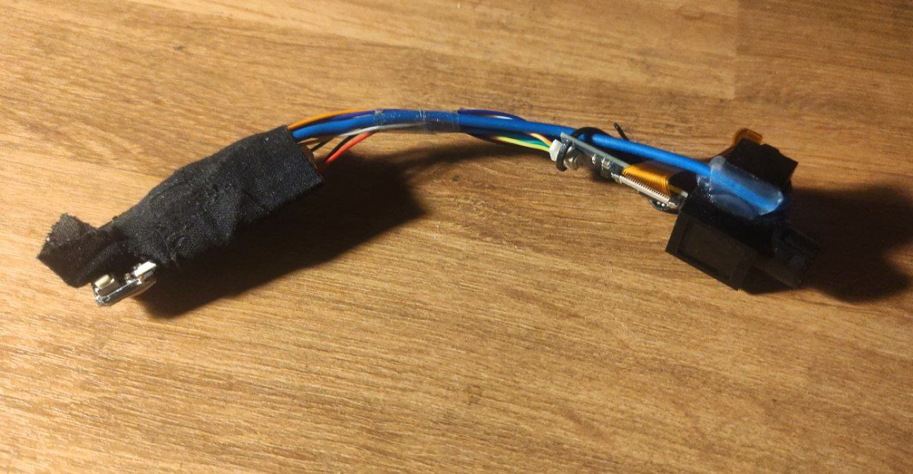

# Project FlyScope

A GPS-based HUD with programmable output designed to aid in wingsuit flying and competitions.

### Device generations
1-st: Based on transparent OLED display and NMEA. No longer in development, code remains in https://github.com/RomanTheLegend/WingsuitGps/tree/legacy_device

2-nd: Based on TFT display and NMEA. No longer in development

3-rt: Based on ocular TFT display and UBX protocol. Currently developed:

## Current project stage: raw prototypes & lots of untested code. Lots of work ahead and your contributions are warmly welcome

### Currently developed modes
* Competition
  - Displays speed & altitude
  - Detects the exit
  - Helps stay in the designated lane
  - Closely follows FlySight algorythms for results calculation
* Horizontal speed
* Random speed
  - Used for testing UI rendering
* Heading

## Parts required
* ESP32 board with buttons
* Monocular display (https://www.aliexpress.com/item/1005001406805469.html)
* UART-based GPS receiver (for ex. GPS GY-NEO7MV2 NEO-7M) - beware! NEO-6M does not support UBX protocol
* Micro-USB LiIon charger (for ex. TP4056)
* Li-Ion battery rated at least 3.7v (GPS receiver requires 3.3v-5v )
* L-shaped USB-C cable extension (optional)
* On/Off slide switch

## How To
* [Install ESP32 board support in Arduino ](https://microcontrollerslab.com/install-esp32-arduino-ide/)

## 1-st generation device
