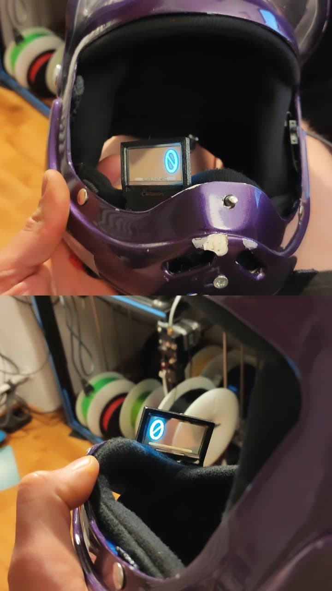
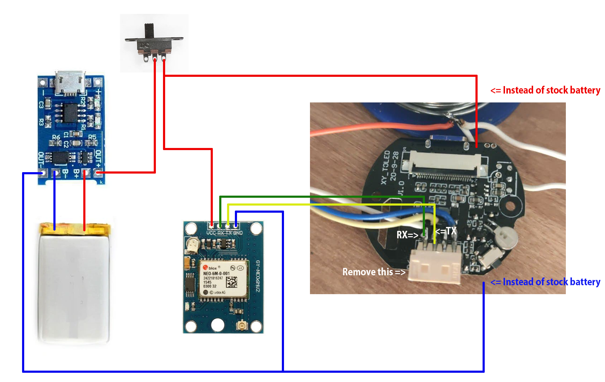

#Project Orion

A GPS-based HUD with programmable output designed to aid in wingsuit flying. At present it displays horisontal speed (km/h) but can be programmed to display more. Possibilities (in future code releases):
Basic:
* Vertical speed
* Total speed
* Altitude (AMSL)
* Glide ratio
* Heading
* Direction to target
* Distance

Advanced:
* Deviation from designited fligh window
* Canopy mode
* you name it...

## Parts required
* LilyGo TTV ( https://www.aliexpress.com/item/1005001681414979.html )
* UART-based GPS receiver (for ex. GPS GY-NEO6MV2 NEO-6M)
* Micro-USB LiIon charger (for ex. TP4056)
* Li-Ion battery rated at least 3.7v (GPS receiver requires 3.3v-5v )
* L-shaped USB-C cable extension (optional)
* On/Off slide switch

## Assembly

* Disassemble TTV unit (https://www.youtube.com/watch?v=039iSQ2LBbM)
* Remove battery (unsolder)
* Remove IR unit (unsolder)
* Remove P6 port (unsolder)
* Solder GPS RX/TX as shown below:

* 3D print basic models for enclosure
